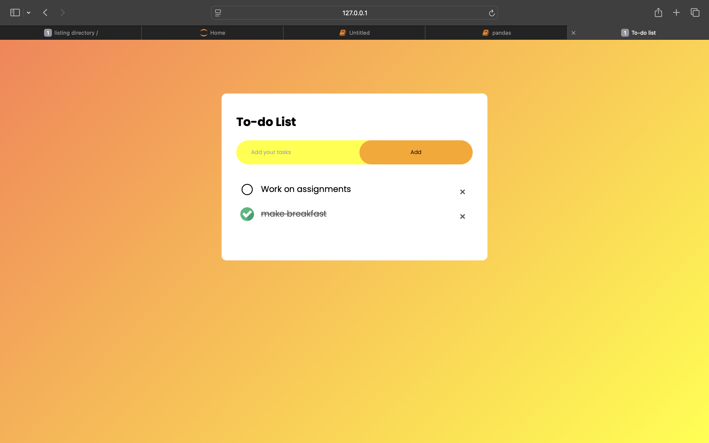

# To-do-list-Web-Application
A simple and interactive to-do list web application built using **HTML**, **CSS**, and **JavaScript**. The app allows users to add, mark, and remove tasks efficiently with a clean, modern design.

## Screenshot



## Features

- **Add new tasks**: Easily add tasks to your to-do list.
- **Mark tasks as completed**: Click on a task to cross it out and show a checkmark.
- **Delete tasks**: Remove tasks from your list when done.
- **Customizable task icons**: Change icons for unchecked and checked tasks.
- **Responsive design**: The app adjusts to different screen sizes.

## Tech Stack

- **HTML** for structure and content.
- **CSS** for styling and layout.
- **JavaScript** for functionality (handling tasks, checking and deleting items).

## Project Setup

Follow the steps below to get the project up and running on your local machine:

### 1. Clone the repository
   ```bash
   git clone https://github.com/charvimaurya/to-do-list.git